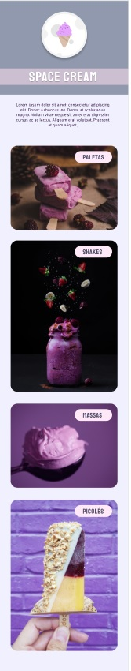
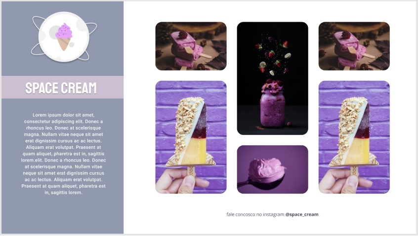

<h1 align="center"> Projeto - 03 </h1>

Este projeto é promovido pela Rocketseat para ensino de tecnologias WEB.  

  <a href="#-tecnologias">Tecnologias</a>&nbsp;&nbsp;&nbsp;|&nbsp;&nbsp;&nbsp;
  <a href="#-projeto">Projeto</a>&nbsp;&nbsp;&nbsp;&nbsp;&nbsp;&nbsp;

 

  Versão mobile

  

 
  Versçao Desktop
  

## 🚀 Tecnologias

Esse projeto foi desenvolvido com as seguintes tecnologias:

- HTML e CSS
- Git
- Figma

## 💻 Projeto

Terceiro projeto/desafio proposto na trilha Explorer da Rocketseat para familiarizar com conceitos básicos de HTML e CSS, junto com conceitos de responsividade e animção com CSS.

- [Visite o projeto online](https://rafaeldsal.github.io/desafio-stage03/)
